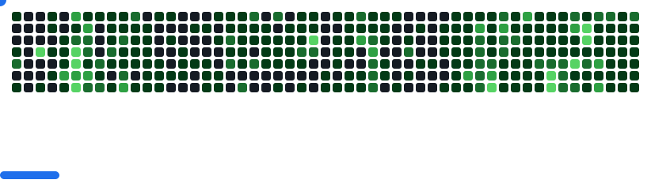

  <ul align="center" style="list-style: none">
    

      <h1>
        👋 Hi, my name is An 
      </h1>
    

  </ul>

**<h3 align="left">Connect with me:</h3>** 
  

 **<h3 align="left">🚀 Passionate computer science student. Decent knowledge about front-end, back-end, competitive programming and game engine, with a keen eye for user experience and performance optimization.</h3>**

**<h3 align="left">Rapid Fire</h3>**

- 💼 I'm currently working on: **Development self note taking app**
- 🌱 I'm currently learning: **Korean**
- 💬 Ask me about: **💡 Please don't ask me. Just googling your self**
- ⚡ Fun fact: **🎢 I'm use Arch btw!**

 **<h3 align="left">Skills</h3>**

            

**<h3 align="left">GitHub Stats</h3>**

  
  

 **<h3 align="left">Support Me</h3>**

